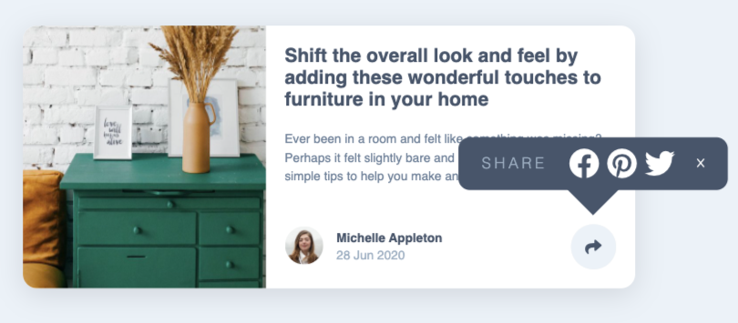
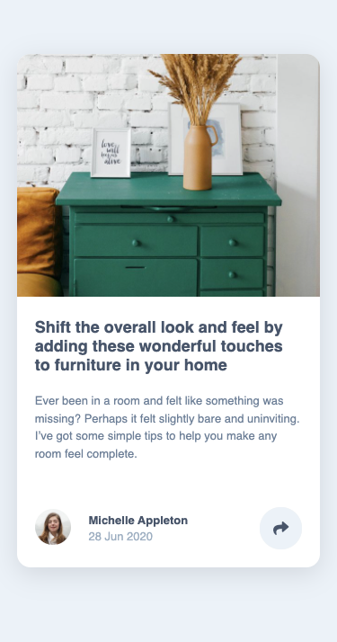
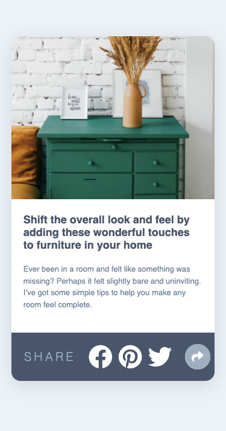

# Frontend Mentor - Article preview component solution

This is a solution to the [Article preview component challenge on Frontend Mentor](https://www.frontendmentor.io/challenges/article-preview-component-dYBN_pYFT). Frontend Mentor challenges help you improve your coding skills by building realistic projects.

## Table of contents

- [Overview](#overview)
  - [The challenge](#the-challenge)
  - [Screenshot](#screenshot)
  - [Links](#links)
- [My process](#my-process)
  - [Built with](#built-with)
  - [What I learned](#what-i-learned)
  - [Continued development](#continued-development)
  - [Useful resources](#useful-resources)
- [Author](#author)


## Overview

### The challenge

Users should be able to:

- View the optimal layout for the component depending on their device's screen size
- See the social media share links when they click the share icon

### Screenshot





### Links

- Solution URL: [Add solution URL here](https://your-solution-url.com)
- Live Site URL: [Add live site URL here](https://your-live-site-url.com)

## My process

### Built with

- Semantic HTML5 markup
- CSS custom properties
- Flexbox
- Mobile-first workflow

### What I learned

I learned how to add a shape to the bottom of a div.

```css
.open-share {
  background: var(--Very-Dark-Grayish-Blue);
  padding: 0.35rem;
  position: absolute;
  left: 21rem;
  width: 55%;
  height: 25%;
  border-radius: 15px 15px 15px 15px;
  display: flex;
  display: none;
  justify-content: space-evenly;
  align-items: center;
  top: 40%;
  transform: scale(0.8);
}
```

I learned how to change the display from none to visible by clicking on an element.

```js
document.querySelector(".share-btn").addEventListener("click", function () {
  document.querySelector(".open-share").style.display = "none";
  document.querySelector(".open-share").style.display = "flex";
});
```

### Continued development

Get more comfortable using Javascript. Figure out how to build more complex functions instead of finding a work around. For example to close the pop up share window on the desktop screen size I inserted an "x" icon and made a new function.

### Useful resources

- [Box Shadow Examples](https://getcssscan.com/css-box-shadow-examples) - This helped me decide which box shadow to use. I really liked this site and will use it going forward.
- [Center Triangle at Bottom of Div](http://jsfiddle.net/9AbYc/1/) - This is an helped me understand how to add an arrow shape to the bottom of the div container.

## Author

- Frontend Mentor - [@adrianna-thomas](https://www.frontendmentor.io/profile/adrianna-thomas)

